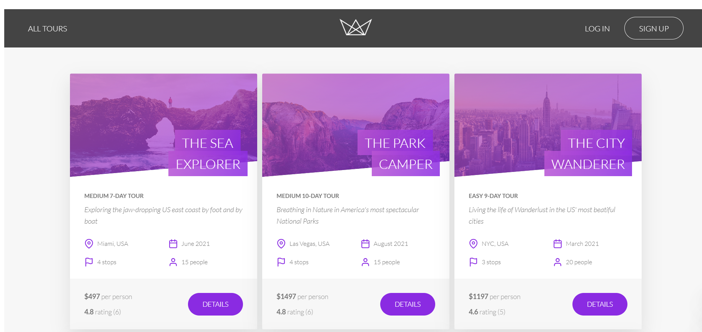

# 🌄 Natours Project

Natours is a modern application built using Node.js, Express, MongoDB, and Mongoose. It is designed to provide a platform for managing and organizing tours and related services.



## 📁 Project Structure

```
Natours/
│
├── controllers/
├── models/
├── public/
├── routes/
├── utils/
├── views/
│
├── app.js
├── server.js
├── package.json
├── package-lock.json
└── README.md
```

## 📋 Prerequisites

- Node.js (version 16 or higher)
- MongoDB

## 🚀 Installation

1. Clone the repository:

   ```
   git clone https://github.com/mikae/Natours.git
   ```

2. Navigate to the project directory:

   ```
   cd Natours
   ```

3. Install dependencies:

   ```
   npm install
   ```

4. Set up environment variables:
   Create a `.env` file in the root directory and add your MongoDB connection string and other required variables.

## 🏃‍♂️ Running the Application

To run the application in development mode:

```
npm run dev
```

To start the server:

```
npm start
```

## 🛣️ API Documentation

API documentation is available at `/api-docs` when the server is running.

## 🛠️ Technologies Used

- **Express.js**: Web application framework
- **MongoDB**: Database
- **Mongoose**: MongoDB object modeling tool
- **Pug**: Template engine
- **JSON Web Tokens (JWT)**: Authentication
- **Bcrypt**: Password hashing
- **Nodemailer**: Email functionality
- **Multer**: File uploading
- **Sharp**: Image processing
- **Stripe**: Payment processing
- **Swagger**: API documentation

## 🔒 Security Features

- CORS (Cross-Origin Resource Sharing)
- Rate limiting
- Data sanitization against NoSQL query injection
- XSS protection
- HTTP security headers with Helmet

## 👨‍💻 Author

Mikael Engvall

## 📄 License

This project is licensed under the ISC License!

## 🌟 Key Features and Functionality

1. **User Authentication and Authorization**

   - Sign up, log in, and log out functionality
   - Password reset via email
   - Role-based access control (admin, guide, user)

2. **Tour Management**

   - Create, read, update, and delete tours
   - Advanced filtering, sorting, and pagination of tours
   - Tour statistics and analytics

3. **Booking System**

   - Users can book tours
   - Secure payment processing with Stripe integration
   - Booking management for users and admins

4. **User Profile**

   - Update user information
   - Change password
   - Upload and manage profile picture

5. **Review System**

   - Users can leave reviews for tours they've taken
   - Calculate and display average ratings for tours

6. **Interactive Maps**

   - Display tour locations on interactive maps
   - Show tour routes and stops

7. **Email Notifications**

   - Welcome emails for new users
   - Password reset emails
   - Booking confirmation emails

8. **Image Processing**

   - Resize and optimize tour and user images
   - Store multiple sizes of images for responsive design

9. **Performance Optimization**

   - Implement caching strategies
   - Database indexing for faster queries

10. **API Features**

    - RESTful API design
    - Advanced filtering, sorting, and pagination
    - Field limiting and aliasing

11. **Error Handling**

    - Global error handling middleware
    - Detailed error messages in development mode
    - Simplified error messages in production mode

12. **Data Modeling**

    - Implement data validation and sanitization
    - Use of Mongoose middleware for data processing

13. **Server-Side Rendering**

    - Use Pug templates for server-side rendering of pages
    - Implement a responsive design for various screen sizes

14. **Security Measures**

    - Implement rate limiting to prevent brute-force attacks
    - Use security headers to protect against common vulnerabilities
    - Sanitize user input to prevent XSS attacks

15. **Geospatial Queries**
    - Find tours within radius
    - Calculate distances from user locations

This application provides a comprehensive solution for tour management, from user authentication to booking processing, with a focus on security, performance, and user experience.
